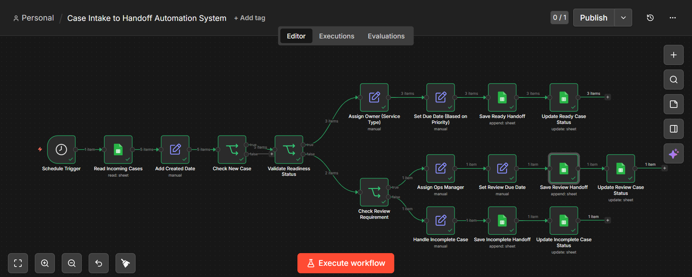
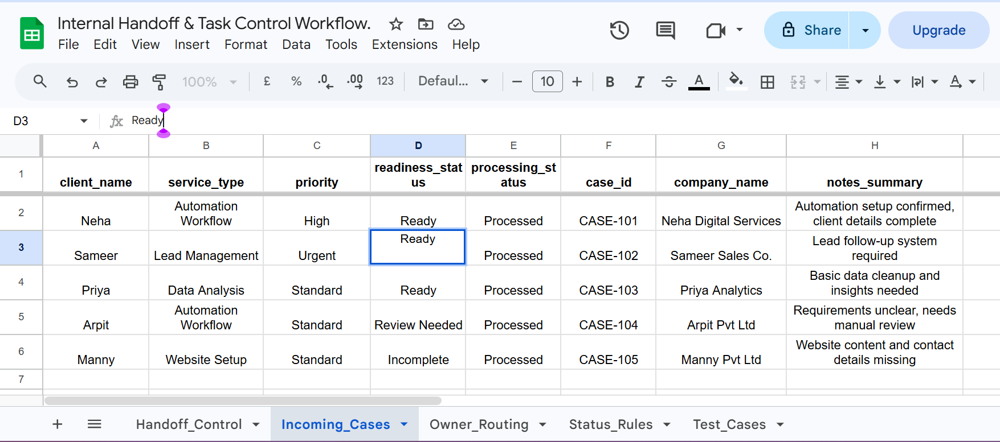
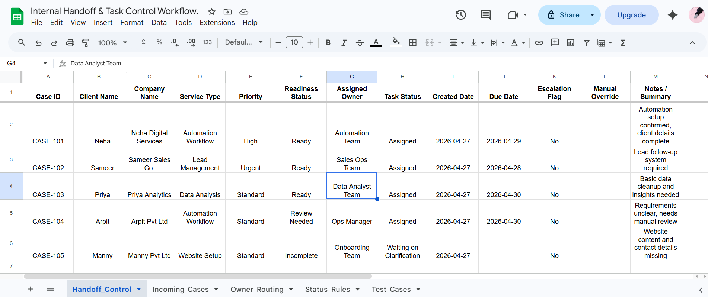

# Case Intake to Handoff Automation System

## Overview
This project automates the transformation of incoming client/onboarding cases into structured internal handoff tasks.

The system validates case readiness, assigns ownership based on service type, sets due dates based on priority, and ensures cases are processed only once.

---

## Problem
In many operations teams, incoming requests are:
- unstructured
- inconsistently assigned
- manually tracked
- prone to duplication

This leads to delays, confusion, and missed follow-ups.

---

## Solution
Built an automated workflow using n8n that:

- reads new cases from a central intake sheet  
- validates readiness status  
- routes cases to the correct team  
- assigns task status  
- sets due dates based on priority  
- handles exceptions (review / incomplete cases)  
- creates structured handoff records  
- prevents duplicate processing  

---

## Workflow Logic

### Input
Incoming_Cases sheet:
- client_name  
- service_type  
- priority  
- readiness_status  
- notes_summary  
- processing_status  
- case_id  

---

### Processing
1. Detect new cases (`processing_status = New`)  
2. Validate readiness  
3. Branch logic:
   - Ready → assign team + due date  
   - Review Needed → assign Ops Manager  
   - Incomplete → send to onboarding team  
4. Create handoff record  
5. Mark original case as processed  

---

### Output
Handoff_Control sheet:
- Case ID  
- Client Name  
- Company Name  
- Assigned Owner  
- Task Status  
- Created Date  
- Due Date  
- Escalation Flag  
- Notes  

---

## Screenshots

### Workflow Overview

### Incoming Cases

### Handoff Control Output

---

## Key Features

- Automated case routing  
- Priority-based SLA (due dates)  
- Exception handling (review / incomplete)  
- Idempotent processing (no duplicates)  
- Clear separation of intake vs execution  

---

## Tools Used

- n8n (workflow automation)  
- Google Sheets (data layer)  

---

## Outcome

- Reduced manual task assignment  
- Improved clarity of ownership  
- Standardized workflow structure  
- Prevented duplicate processing  
